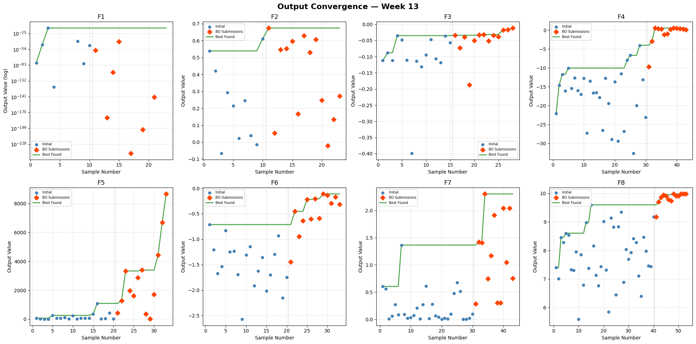

# Capstone SDD: Black-Box Optimisation Challenge

A 13-week Bayesian optimisation campaign tackling eight black-box functions (F1–F8) with input dimensionalities ranging from 2D to 8D. Each function was optimised iteratively using tailored surrogate models and acquisition functions, with one submission per week from Week 3 to Week 13. All inputs are bounded within [0, 0.999999] and the objective is maximisation.

This project was completed as part of a postgraduate certificate course in AI and ML. The optimisation pipeline is built on the BoTorch and PyTorch stack, with a compact neural network surrogate used for one function (F7). Strategies were refined weekly based on observed results and systematic surrogate evaluation using prequential evaluation.

---

## Table of Contents

- [Project Overview](#project-overview)
- [F1 — Radiation Source Detection](#f1--radiation-source-detection)
- [F2 — Noisy Log-Likelihood](#f2--noisy-log-likelihood)
- [F3 — Drug Discovery](#f3--drug-discovery)
- [F4 — Warehouse Product Placement](#f4--warehouse-product-placement)
- [F5 — Chemical Process Yield](#f5--chemical-process-yield)
- [F6 — Cake Recipe Optimisation](#f6--cake-recipe-optimisation)
- [F7 — ML Hyperparameter Tuning](#f7--ml-hyperparameter-tuning)
- [F8 — 8D ML Hyperparameters](#f8--8d-ml-hyperparameters)
- [Results Summary](#results-summary)
- [Convergence Plots](#convergence-plots)
- [Critical Evaluation](#critical-evaluation)
- [Lessons Learnt](#lessons-learnt)
- [Project Structure](#project-structure)
- [References](#references)

---

## Project Overview

This project addresses a black-box optimisation challenge comprising eight functions, each representing a distinct real-world-inspired domain: radiation source detection, statistical inference, drug discovery, warehouse logistics, chemical engineering, food science, and machine learning hyperparameter tuning. The functions span 2 to 8 input dimensions, and the true functional forms are unknown — the only information available is input–output pairs obtained by querying a black-box oracle.

The optimisation follows a Bayesian optimisation (BO) framework:

1. **Surrogate modelling**: A probabilistic model is fitted to observed data to approximate the unknown function.
2. **Acquisition function**: An acquisition function balances exploration (sampling uncertain regions) with exploitation (sampling near known good regions) to propose new query points.
3. **Oracle evaluation**: Proposed points are submitted to the black-box oracle, which returns true function values.
4. **Iteration**: The surrogate is updated with the new observations and the process repeats.

Over 12 weekly submission rounds (Weeks 3–13), each function received 13 additional data points beyond its initial sample. Strategies were adapted based on observed performance, with surrogate models, kernels, acquisition functions, and output transforms adjusted as the campaign progressed.

| Function | Domain | Dimensions | Initial Samples | Final Samples |
|----------|--------|-----------|----------------|---------------|
| F1 | Radiation Source Detection | 2 | 10 | 23 |
| F2 | Noisy Log-Likelihood | 2 | 10 | 23 |
| F3 | Drug Discovery | 3 | 15 | 28 |
| F4 | Warehouse Product Placement | 4 | 30 | 43 |
| F5 | Chemical Process Yield | 4 | 20 | 33 |
| F6 | Cake Recipe Optimisation | 5 | 20 | 33 |
| F7 | ML Hyperparameter Tuning | 6 | 30 | 43 |
| F8 | 8D ML Hyperparameters | 8 | 40 | 53 |

---

## F1 — Radiation Source Detection

**Dimensionality**: 2D | **Best output**: 7.71 × 10⁻¹⁶ | **Final surrogate**: SFGP Matérn-2.5 + qLogNEI

### Strategy

F1 presents a zero-inflated output distribution where the vast majority of observations return zero or near-zero values, indicating the radiation source has not been detected. This characteristic renders standard regression surrogates ineffective.

**Weeks 3–9**: A two-stage **Hurdle Model** was employed — a calibrated logistic regression classifier predicted P(y > 0) and gated a random forest regressor trained on log1p-transformed positive outputs. The acquisition function used weighted UCB (κ=3.0) with interior penalty (S=0.1) and local penalisation (radius=0.15) to encourage spatial diversity. A FALLBACK_MODE activated when fewer than 3 positive samples existed, reverting to pure exploration.

**Week 10**: The strategy was fundamentally changed to a **SingleTaskGP with Matérn-2.5 kernel and qLogNEI** (q=4). The Hurdle Model lacked the structured uncertainty estimates needed for principled BO acquisition, and the growing dataset supported a GP fit.

**Weeks 11–13**: Continued with SFGP Matérn-2.5 + qLogNEI, reducing to q=1 for exploitation focus. The interior penalty was removed in Week 13.

### Results

Despite two distinct surrogate strategies across 12 submission rounds, the radiation source was never located. The best observed value of 7.71 × 10⁻¹⁶ is essentially zero. This is the least successful function in the campaign, suggesting the source may be in a very narrow, unexplored region of the 2D space.

---

## F2 — Noisy Log-Likelihood

**Dimensionality**: 2D | **Best output**: 0.674 | **Final surrogate**: SFGP Matérn-2.5 + qLogNEI

### Strategy

F2 models a noisy log-likelihood surface — a relatively well-behaved 2D function with mixed-sign outputs and moderate noise.

**Weeks 3–9**: A **SingleTaskGP with Matérn-1.5 kernel** (ARD, noise_lb=1e-3) was used with qLogNEI (q=4). The rougher Matérn-1.5 kernel was initially chosen to accommodate the noisy nature of the function. Distance-based candidate selection filtered batch candidates to promote spatial diversity.

**Week 10**: The kernel was upgraded to **Matérn-2.5** as the accumulating dataset supported a smoother surrogate fit, which better captured the underlying function structure.

**Weeks 11–13**: Continued with SFGP Matérn-2.5 + qLogNEI, reducing to q=1 for late-stage exploitation.

### Results

The optimisation achieved a best output of 0.674, showing steady improvement over the campaign. The 2D surface was well-suited to a standard GP approach, and the transition from rougher to smoother kernel reflected increasing confidence in the function's regularity as data accumulated.

---

## F3 — Drug Discovery

**Dimensionality**: 3D | **Best output**: −0.0114 | **Final surrogate**: SFGP Matérn-2.5 + qLogNEI

### Strategy

F3 has an entirely negative output domain, where the objective is to find the least negative value. This characteristic complicates acquisition functions that use zero as a reference point.

**Weeks 3–7**: A **SingleTaskGP with Matérn-2.5 kernel** (ARD) was used with qLogNEI (q=1) and manual z-score standardisation to shift the all-negative outputs to zero mean.

**Week 8**: The batch size was increased to q=3 with output shifting to better handle the negative value domain. Three-colour diagnostics were introduced for model validation.

**Weeks 10–13**: Tuning refinements continued, with the batch size reduced back to q=1 for exploitation in the final weeks.

### Results

The best output improved from −0.031 (Week 9) to −0.0114, approaching zero — the theoretical optimum direction. The Matérn-2.5 kernel remained effective throughout the campaign, with manual z-score standardisation successfully addressing the all-negative domain challenge.

---

## F4 — Warehouse Product Placement

**Dimensionality**: 4D | **Best output**: 0.532 | **Final surrogate**: SFGP Matérn-2.5 + qLogNEI

### Strategy

F4 features a 4D input space with a wide output range (−32.6 to 0.5), including extreme negative outliers.

**Weeks 3–9**: A **Multi-Fidelity GP** (SingleTaskMultiFidelityGP with LinearTruncatedFidelityKernel) was used as a deliberate regularisation strategy. Although all data was collected at fidelity=1.0, the MFGP's fidelity kernel provided implicit regularisation that improved generalisation. This approach won the prequential evaluation with the best negative log-predictive density (−1.35).

**Week 10**: Transitioned to a **standard SingleTaskGP with Matérn-2.5 kernel**, dropping the fidelity dimension. As the dataset grew, the simpler model proved equally competitive without the overhead of the extra fidelity parameter.

**Weeks 11–13**: Continued with SFGP Matérn-2.5 + qLogNEI, reducing to q=1 for exploitation.

### Results

The best output of 0.532 was achieved early and maintained. The transition from MFGP to simpler SFGP demonstrates how surrogate complexity should be matched to available data — the MFGP's regularisation benefit diminished as the dataset grew large enough for a standard GP to generalise well.

---

## F5 — Chemical Process Yield

**Dimensionality**: 4D | **Best output**: 8,662.4 | **Final surrogate**: SFGP Matérn-1.5 + qLogNEI

### Strategy

F5 has an extremely heavy-tailed output distribution spanning nearly five orders of magnitude (0.11 to 8,662.4), requiring careful output transforms.

**Weeks 3–4**: Standard BO with **SFGP Matérn-5/2** and EI achieved a best output of approximately 1,089.

**Week 5**: A **Gradient-Boosted Tree ensemble** (10 models) with UCB (κ=2.5) was tested as an alternative, departing from the GP framework.

**Week 8**: Returned to GP with a critical innovation — a **log1p→z-score transform chain** and an **in-loop additive interior penalty** (S=1.0, F=0.01) applied within the acquisition function evaluation in log-space. This fixed a failure mode where multiplicative penalties in log-space inverted the acquisition landscape. The result was a major jump to outputs exceeding 3,000.

**Week 9**: Switched to **Matérn-1.5** kernel, better suited to the rough, heavy-tailed surface with limited data.

**Weeks 10–12**: Progressive tuning — MLL restarts increased from 50 to 60, raw samples from 5,000 to 8,000, distance gate relaxed.

**Week 13**: Interior penalty removed, batch reduced to q=1 for final exploitation.

### Results

F5 showed the most dramatic improvement in the campaign, with the best output rising from ~1,089 to 8,662.4 — approximately a 3.1× improvement factor. The breakthrough came from combining the log1p output transform with the corrected in-loop interior penalty in Week 8.

---

## F6 — Cake Recipe Optimisation

**Dimensionality**: 5D | **Best output**: −0.111 | **Final surrogate**: SFGP Matérn-1.5 + qLogNEI (rank-based IP)

### Strategy

F6 has an all-negative output domain representing quality deductions from an ideal recipe. Standard multiplicative interior penalties invert acquisition rankings when applied to negative values, requiring a novel approach.

**Weeks 3–4**: Standard BO with **SFGP Matérn-5/2** and EI achieved a best output of approximately −0.714.

**Week 5**: A **Neural Network** (5→64→32→1) with MC Dropout UCB was tested for this 5D space.

**Week 8**: Settled on **SFGP Matérn-1.5** with qLogNEI and a **rank-based interior penalty** — a sign-invariant design that uses rank ordering rather than multiplicative scaling, preventing the ranking inversion problem for negative outputs. A **milk constraint** (x₄ ≥ 0.10) was introduced to enforce physical recipe constraints.

**Weeks 10–13**: Progressive refinement — noise floor reduced from 1e-2 to 1e-3, milk constraint tightened from 0.10 to 0.12, raw samples increased from 3,000 to 5,000.

### Results

The best output improved from −0.714 to −0.111, representing approximately 85% improvement (closer to zero is better). The rank-based interior penalty was the key innovation, solving the sign-inversion problem that would have rendered standard boundary-suppression techniques ineffective for this all-negative function.

---

## F7 — ML Hyperparameter Tuning

**Dimensionality**: 6D | **Best output**: 2.305 | **Final surrogate**: Compact NN (6→5→5→1) + blended acquisition

### Strategy

F7 is the only function that retained a neural network surrogate throughout the late stages of the campaign, reflecting the challenges of GP scalability in 6D.

**Weeks 3–4**: Standard BO with **SFGP Matérn-5/2** and EI.

**Week 5**: Switched to a **large Neural Network** (6→128→64→32→1) with MC Dropout UCB (κ=2.5) on 20,000 candidates, motivated by the 6D input space where GP kernel estimation becomes difficult.

**Week 8**: The network was dramatically **compacted to 6→5→5→1** (71 parameters) with MC Dropout EI, interior penalty (S=0.1, F=0.01), and 200 training epochs. The compact architecture was a deliberate trade-off to prevent overfitting on 39 data points.

**Weeks 9–13**: Adopted a **blended acquisition function** (0.7×posterior_mean + 0.3×EI), favouring exploitation. Dropout was reduced from 0.1 to 0.05, and the interior penalty was relaxed (S=0.05, F=0.02).

### Results

The best output of 2.305 reflects moderate success. The compact NN architecture was a pragmatic compromise: it scaled better than GPs in 6D but provided less reliable uncertainty estimates. The blended acquisition function's exploitation focus (70% mean, 30% EI) was necessary because MC Dropout uncertainty was not sufficiently calibrated for pure EI-driven search.

---

## F8 — 8D ML Hyperparameters

**Dimensionality**: 8D | **Best output**: 9.982 | **Final surrogate**: SFGP Matérn-2.5 + qEI

### Strategy

F8 is the highest-dimensional function in the challenge. Despite this, a GP-based approach proved effective, aided by the relatively large initial dataset (40 samples) and well-behaved output distribution within a narrow positive range.

**Weeks 3–4**: Standard BO with **SFGP Matérn-5/2** and EI.

**Week 5**: A **Neural Network** (8→128→64→32→1) with MC Dropout UCB was tested, following the same pattern as F6 and F7.

**Week 8**: Returned to a **GP approach with Matérn-2.5 kernel and qEI** (q=1, XI=0.01). The GP outperformed the NN for this function, likely because the high initial sample count (40) provided adequate coverage for kernel estimation. A **Sobol fallback** mechanism was introduced: when all qEI values are zero (flat acquisition surface), the candidate with the highest posterior mean from 4,096 Sobol samples is selected.

**Weeks 9–13**: Strategy remained stable throughout. Three-colour diagnostics were added in Week 9 for model validation.

### Results

The best output of 9.982 demonstrates that GP-based BO can be effective even in 8D when the initial dataset is sufficiently large and the output landscape is well-behaved. The narrow output range [5.592, 9.982] and the Sobol fallback mechanism ensured consistent progress despite the curse of dimensionality.

---

## Results Summary

The table below summarises the final optimisation results for all eight functions after 12 weekly submission rounds (Weeks 3–13). Each function received exactly 13 additional data points (3 in Week 3, then 1 per week for Weeks 4–13).

| Function | Dims | Initial | Final | Best Output | Convergence Trend | Final Surrogate |
|----------|------|---------|-------|-------------|-------------------|-----------------|
| F1 | 2 | 10 | 23 | 7.71 × 10⁻¹⁶ | Flat (source not found) | SFGP Matérn-2.5 |
| F2 | 2 | 10 | 23 | 0.674 | Steady improvement | SFGP Matérn-2.5 |
| F3 | 3 | 15 | 28 | −0.0114 | Gradual improvement | SFGP Matérn-2.5 |
| F4 | 4 | 30 | 43 | 0.532 | Early peak, stable | SFGP Matérn-2.5 |
| F5 | 4 | 20 | 33 | 8,662.4 | Dramatic jump (Week 8) | SFGP Matérn-1.5 |
| F6 | 5 | 20 | 33 | −0.111 | Steady improvement | SFGP Matérn-1.5 |
| F7 | 6 | 30 | 43 | 2.305 | Moderate improvement | NN (6→5→5→1) |
| F8 | 8 | 40 | 53 | 9.982 | Consistent gains | SFGP Matérn-2.5 |



**Key observations**:

- **Convergence by final surrogate**: Six of eight functions converged on SFGP (Single-task Gaussian Process) as their final surrogate, underscoring the GP's versatility across different dimensionalities and output characteristics.
- **Most improved**: F5 showed the most substantial improvement, with the best output rising from approximately 1,089 to 8,662.4 (a factor of 3.1) after introducing the log1p transform and in-loop interior penalty in Week 8.
- **Least improved**: F1 did not locate the radiation source across the entire campaign, despite employing two distinct surrogate strategies.
- **Exploitation phase**: All functions shifted toward exploitation in Weeks 11–13, reducing batch sizes to q=1 and removing or relaxing interior penalties.

---

## Convergence Plots

Convergence plots for all eight functions are generated in [`functions/results/process_results.ipynb`](functions/results/process_results.ipynb). The notebook produces a **2×4 grid** of line plots, one per function, showing the **running best-observed output** (y-axis) against the **iteration number** (x-axis) across the full optimisation campaign.

Each plot visualises:

- **The cumulative best**: A monotonically non-decreasing line showing the best output observed up to each iteration, starting from the initial dataset and extending through all 12 submission rounds.
- **Improvement trajectory**: Where significant jumps occurred (e.g., F5's dramatic rise in Week 8) and where the optimisation plateaued (e.g., F1's flat line near zero).
- **Strategy change impact**: The effect of surrogate transitions and hyperparameter changes can be inferred from inflection points in the convergence curves.

To view the convergence plots, open and execute the notebook:

```
functions/results/process_results.ipynb
```

---

## Critical Evaluation

### F1 — Radiation Source Detection

- **Strength**: The Hurdle Model was a creative, domain-appropriate response to the zero-inflated distribution — standard surrogates would have been entirely ineffective. The pivot to SFGP in Week 10 was a pragmatic acknowledgment that the Hurdle Model lacked structured uncertainty.
- **Weakness**: Despite two distinct surrogate strategies across 12 rounds, the radiation source was never located. This suggests a fundamental limitation: with 23 points in 2D, the search may have missed a very narrow source region. A space-filling design (e.g., Latin Hypercube) might have been more effective than model-guided search for this type of needle-in-a-haystack problem.

### F2 — Noisy Log-Likelihood

- **Strength**: The standard GP approach worked well on this well-behaved 2D surface. The kernel upgrade from Matérn-1.5 to Matérn-2.5 in Week 10 was appropriately data-driven — as observations accumulated, a smoother kernel became justified.
- **Weakness**: The best output (0.674) was achieved relatively early, with limited improvement in later weeks. The exploitation phase may have started too late, or the distance-based candidate selection may have been overly conservative in avoiding the region around the optimum.

### F3 — Drug Discovery

- **Strength**: The consistent use of Matérn-2.5 throughout the campaign, combined with manual z-score standardisation, effectively handled the all-negative output domain. The improvement from −0.031 to −0.0114 in the later weeks shows the exploitation phase was productive.
- **Weakness**: The batch size changes (q=1 → q=3 → q=1) suggest uncertainty about the optimal acquisition strategy. A more systematic approach to batch sizing — perhaps adaptive based on surrogate uncertainty — could have been more efficient.

### F4 — Warehouse Product Placement

- **Strength**: The MFGP-as-regulariser approach (Weeks 3–9) was an innovative use of multi-fidelity architecture for single-fidelity data, validated by prequential evaluation. The subsequent simplification to SFGP demonstrated appropriate model selection as data accumulated.
- **Weakness**: The wide output range (−32.6 to 0.5) with extreme negative outliers may have distorted the GP fit despite z-score standardisation. A robust output transform (e.g., Winsorisation or rank-based) could have further improved the surrogate quality.

### F5 — Chemical Process Yield

- **Strength**: F5 demonstrated the largest improvement in the campaign (approximately 3.1× factor). The combination of log1p output transform and in-loop additive interior penalty in Week 8 was a breakthrough — correctly diagnosing and fixing the multiplicative penalty inversion in log-space shows strong technical problem-solving.
- **Weakness**: The indirect path through GBT (Week 5) before returning to GP (Week 8) consumed several submission rounds. Prequential evaluation could have eliminated GBT earlier and focused experimentation on output transforms.

### F6 — Cake Recipe Optimisation

- **Strength**: The rank-based interior penalty was a genuine innovation — solving the sign-inversion problem for all-negative outputs where standard multiplicative penalties fail. This technique is generalisable to any function with consistently negative outputs.
- **Weakness**: The neural network experiment in Week 5 provided limited lasting value for this function. The 5D space was adequately handled by the Matérn-1.5 GP with careful constraint engineering (milk ≥ 0.10→0.12).

### F7 — ML Hyperparameter Tuning

- **Strength**: F7 was the only function to retain a neural network surrogate through the late stages, and the progressive architecture compaction (from 6→128→64→32→1 to 6→5→5→1) was a disciplined approach to managing overfitting risk with limited data. The blended acquisition function (0.7×mean + 0.3×EI) was a pragmatic workaround for MC Dropout's poor uncertainty calibration.
- **Weakness**: MC Dropout provides only approximate uncertainty estimates, and the 71-parameter network has very limited representational capacity for a 6D surface. The blended acquisition function's heavy exploitation weighting (70% mean) may have caused premature convergence. A GP with ARD might have performed comparably despite the 6D dimensionality.

### F8 — 8D ML Hyperparameters

- **Strength**: Maintaining a GP approach in 8D (the highest dimensionality in the challenge) was vindicated by consistent improvement. The Sobol fallback mechanism ensured progress even when the acquisition function became flat — a known issue for GP-based BO in high dimensions.
- **Weakness**: The extremely low noise assumption (noise_lb=1e-7) risks overfitting to observed points in 8D, where posterior uncertainty should be high. The q=1 single-candidate approach, while conservative, limited the rate of exploration in a space that desperately needed it.

---

## Lessons Learnt

The following insights emerged from the 13-week optimisation campaign across eight functions of varying dimensionality and output characteristics.

### 1. Prequential Evaluation Before Commitment

Systematic leave-future-out validation (prequential evaluation) proved essential for surrogate selection. Rather than relying on intuition or theoretical properties alone, training surrogates on cumulative data up to week $t$ and evaluating predictive performance at week $t+1$ provided objective evidence for selecting models. This approach correctly identified the MFGP as a useful regulariser for F4, validated the GP over GBT for F5, and confirmed the NN's suitability for F7's 6D space.

### 2. Output Transforms Are Critical for Heavy-Tailed Functions

F5 demonstrated that the right output transform can be more impactful than the choice of surrogate model. The log1p→z-score chain tamed a distribution spanning five orders of magnitude, enabling the GP to fit the transformed surface effectively. Without this transform, the GP fit was dominated by extreme values and produced pathological acquisition landscapes.

### 3. Interior Penalty Design Matters — Especially for Negative Outputs

The campaign revealed that interior penalties must be carefully designed for the output domain. The standard multiplicative penalty worked for positive-output functions but inverted rankings for all-negative outputs (F6). The rank-based penalty developed for F6 and the in-loop additive penalty in log-space for F5 are generalisable solutions to these sign-sensitivity problems.

### 4. GP Surrogates Scale Better Than Expected

Despite conventional wisdom suggesting GPs struggle beyond 5–6 dimensions, the SFGP Matérn-2.5 performed well in 8D (F8) when the initial dataset was sufficiently large (40 samples). The key factor was not dimensionality alone but the ratio of initial samples to input dimensions. F8's 5:1 ratio (40 samples / 8 dimensions) provided adequate coverage for kernel estimation.

### 5. Surrogate Simplification as Data Grows

Several functions (F1, F4) benefited from starting with a complex surrogate and transitioning to a simpler one as data accumulated. The MFGP-to-SFGP transition for F4 and the Hurdle-to-SFGP transition for F1 illustrate that regularisation methods useful in small-data regimes can become unnecessary overhead with more observations. Periodically re-evaluating whether the current surrogate complexity is justified is a valuable practice.

### 6. Late-Stage Exploitation Requires Discipline

All functions shifted to exploitation focus in Weeks 11–13, reducing batch sizes to q=1 and relaxing or removing penalties. This consistent pattern suggests that a structured exploitation schedule — planned in advance rather than reactively — could maximise the value of final submission rounds. The convergence plots show that several functions achieved their best results during this exploitation phase.

### 7. Non-GP Surrogates Have a Narrow Niche

The NN surrogate was retained only for F7, while all other functions settled on GP variants. Neural networks required more careful tuning (architecture, dropout, learning rate, epochs) and provided less reliable uncertainty estimates. GP surrogates, with their analytical posteriors and principled uncertainty quantification, were more robust for the sample sizes (23–53) encountered in this campaign. The NN's advantage appeared only in 6D where GP kernel estimation became challenging.

---

## Project Structure

```
capstone-sdd/
├── README.md                 # This file — project overview, strategies, results, evaluation
├── CONSTITUTION.md           # Project governance principles (v1.1.0)
├── modelcards.md             # Model cards for all 8 surrogate models (Weeks 3–13)
├── datasheets.md             # Datasheets for all 8 datasets (Weeks 3–13)
├── data/
│   ├── f1/ through f8/       # Per-function datasets (.npy files)
│   └── results/              # Aggregated results
├── functions/
│   ├── f1/ through f8/       # Per-function weekly notebooks
│   └── results/              # Cross-function results and convergence plots
│       └── process_results.ipynb
├── research/                 # Exploratory notebooks (prequential evaluation, BO experiments)
└── specs/                    # Feature specifications (speckit workflow)
```

---

## References

- **Model Cards**: [modelcards.md](modelcards.md) — detailed documentation of each surrogate model's architecture, training, performance, assumptions, and limitations across the full Weeks 3–13 campaign.
- **Datasheets**: [datasheets.md](datasheets.md) — data provenance documentation for all eight function datasets, including composition, collection process, and distribution details.
- **Convergence Plots**: [functions/results/process_results.ipynb](functions/results/process_results.ipynb) — Jupyter notebook generating a 2×4 grid of convergence plots showing the running best-observed output for each function over the optimisation campaign.
- **Constitution**: [CONSTITUTION.md](CONSTITUTION.md) — project governance principles guiding technical decisions.
